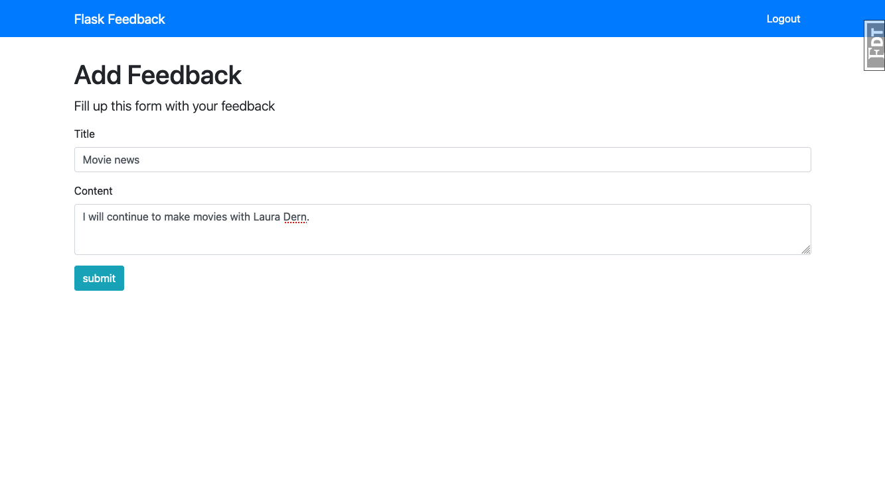
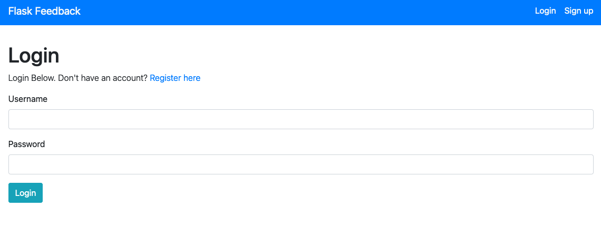
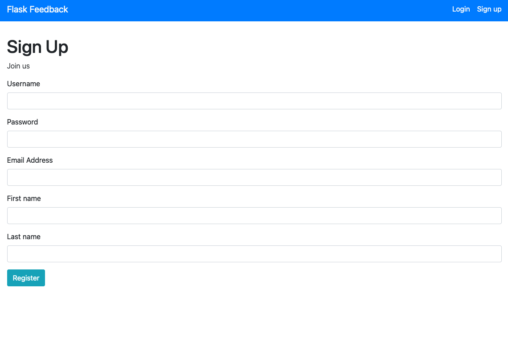
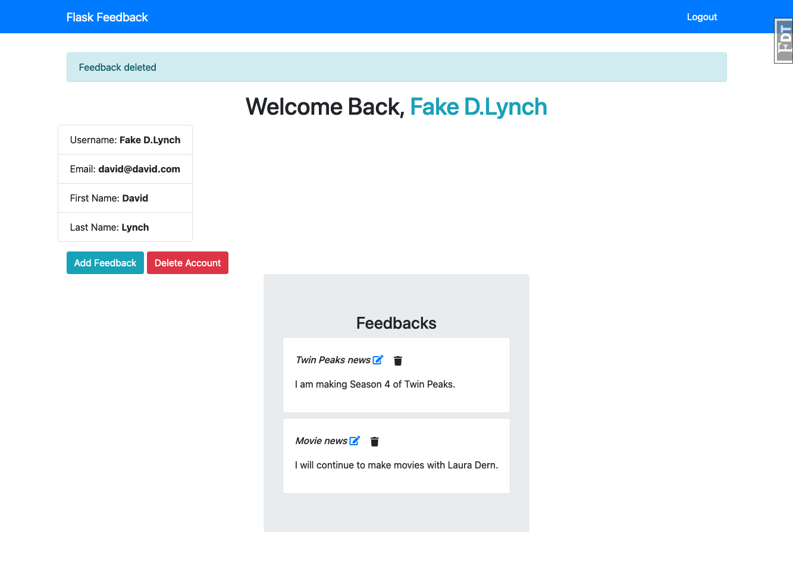

# Flask Feedback App

> This application lets users sign up and log in to their own accounts. Logged in users can
> add, edit, and delete their post. A users route is protected so no other user can add, edit or 
> delete their feedback post.

#### Technologies used in the project:
- Flask
- WTForms
- PostgresSQL

